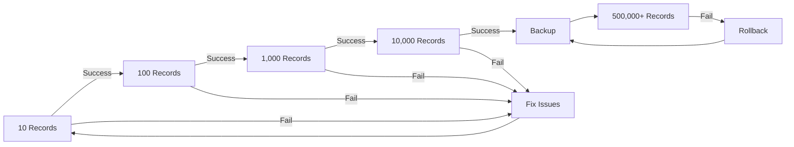

# ✅ Safe Import Checklist

**DO NOT import 500k records until ALL these steps are verified!**

## 📋 Pre-Flight Checklist

### 1️⃣ Deploy & Verify Platform
```bash
cd worktrees/siteforge
.\deploy.ps1  # Run deployment script
```
- [ ] Deployment successful
- [ ] Health endpoint responds: `curl https://[WORKER_URL]/health`
- [ ] Database created and migrations run
- [ ] Can access worker URL without errors

### 2️⃣ Test with 10 Records FIRST
```bash
cd worktrees/siteforge
npm install  # Install dependencies including csv-parse

# Import test data (10 records)
npm run import:test

# Verify it worked
npm run import:verify
```
- [ ] All 10 records imported successfully
- [ ] No errors in wrangler tail
- [ ] Can query data: `npm run monitor:db`
- [ ] Performance < 100ms

### 3️⃣ Test with 100 Records
```bash
# Generate test data
npm run import:generate

# Import 100 records
npm run import:small

# Verify
npm run import:verify
```
- [ ] Import completes in < 2 minutes
- [ ] No memory issues
- [ ] Database queries still fast
- [ ] Error logs clean

### 4️⃣ Test with 1,000 Records
```bash
# Import 1000 records
npm run import:medium

# Monitor during import
npm run monitor:errors  # In separate terminal

# Verify after
npm run import:verify
```
- [ ] Batch processing works
- [ ] No timeouts
- [ ] Can resume if interrupted
- [ ] System still responsive

### 5️⃣ Test with 10,000 Records
```bash
# BACKUP FIRST!
npm run db:backup

# Import 10k records
npm run import:large

# Check performance
npm run import:verify
```
- [ ] Import rate > 100 records/second
- [ ] D1 limits not exceeded
- [ ] Memory usage stable
- [ ] Can rollback if needed

### 6️⃣ Verify Rollback Works
```bash
# Test rollback capability
npm run import:rollback

# Or clean test data only
npm run db:clean

# Verify data removed
npm run monitor:db
```
- [ ] Rollback removes recent imports
- [ ] Can clean test data
- [ ] Database still functional

## 🚀 Production Import (500k+ Records)

### Only proceed if ALL above tests passed!

### Final Preparation
```bash
# 1. Backup empty/test database
npm run db:backup

# 2. Clean all test data
node scripts/rollback-import.js clean

# 3. Verify clean state
npm run monitor:db
```

### Production Import
```bash
# Download real data
curl "https://www.myfloridalicense.com/datadownload/downloadRE.asp" -o fl_agents.csv

# Create progressive import script for real data
node scripts/import-progressive.js fl_agents.csv --force
```

### Monitor During Import (4 terminals)
```bash
# Terminal 1: Run import
node scripts/import-progressive.js fl_agents.csv --force

# Terminal 2: Monitor errors
wrangler tail --format pretty | grep ERROR

# Terminal 3: Watch progress
watch -n 10 'wrangler d1 execute estateflow-db --command="SELECT COUNT(*) FROM professionals;"'

# Terminal 4: System resources (if needed)
# Windows: Task Manager
# Mac/Linux: top or htop
```

## 🚨 Emergency Procedures

### If Import Fails
1. **Check progress file**: `cat import-progress.json`
2. **Resume from last batch**: Re-run same import command
3. **If corrupted**: `npm run import:rollback`

### If Database Locks
1. Wait 30 seconds
2. Reduce batch size in script (change BATCH_SIZE to 500)
3. Add longer delays between batches

### If Out of Memory
```bash
node --max-old-space-size=4096 scripts/import-progressive.js data.csv
```

### If Need Complete Reset
```bash
npm run db:reset  # Will prompt for confirmation
npm run db:migrate  # Re-run migrations
```

## 📊 Success Metrics

### Test Data (10-10,000 records)
- ✅ All test stages complete
- ✅ Performance acceptable (< 100ms queries)
- ✅ No errors in logs
- ✅ Rollback tested

### Production Data (500k+ records)
- ⏳ Import time: 2-3 hours expected
- 📈 Import rate: > 50 records/second minimum
- 💾 Database size: < 500MB (D1 free tier limit)
- ⚡ Query performance: < 100ms for indexed queries

## 🎯 Progressive Testing Path



## 📝 Final Notes

1. **ALWAYS test with small data first** - 10 records reveals 90% of issues
2. **Monitor everything** - Keep wrangler tail running during all imports
3. **Backup before production** - You can't undo 500k bad records easily
4. **Progressive scaling** - Each stage tests different aspects
5. **Have rollback ready** - Know how to recover before you need to

**Remember**: It takes 5 minutes to test with 10 records. It takes hours to clean up 500k bad records!

---

✅ **Ready?** Start with Step 1: Deploy the platform first!
❌ **Not ready?** Review the [DATA_IMPORT_TESTING_GUIDE.md](DATA_IMPORT_TESTING_GUIDE.md) for details.