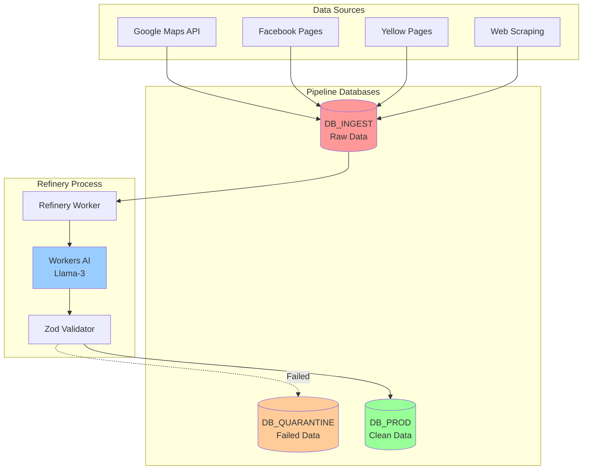

# Data Pipeline Architecture

## Overview

The SiteForge/EnlacePR platform employs a sophisticated "Double D1" pipeline architecture that transforms raw, messy business data into clean, production-ready tenant profiles. This automated pipeline is the engine of our customer acquisition strategy, creating discoverable "ghost profiles" that serve as powerful conversion triggers.

## Pipeline Architecture

### The Double D1 Strategy



## Database Schemas

### DB_INGEST (Raw Data Storage)

```sql
-- Raw business data as scraped
CREATE TABLE raw_businesses (
    id INTEGER PRIMARY KEY AUTOINCREMENT,

    -- Source tracking
    source TEXT NOT NULL, -- 'google_maps', 'facebook', 'yellow_pages'
    source_id TEXT, -- Original ID from source
    campaign TEXT, -- 'unmappable', 'digital_ghosts', 'high_value'

    -- Raw data
    raw_json TEXT NOT NULL, -- Complete JSON from source

    -- Processing status
    status TEXT DEFAULT 'unprocessed', -- 'unprocessed', 'processing', 'processed', 'failed'
    process_attempts INTEGER DEFAULT 0,
    last_attempt TIMESTAMP,

    -- Metadata
    scraped_at TIMESTAMP DEFAULT CURRENT_TIMESTAMP,
    scraper_version TEXT,
    ip_address TEXT
);

-- Campaign configuration
CREATE TABLE scraper_campaigns (
    id INTEGER PRIMARY KEY AUTOINCREMENT,
    name TEXT UNIQUE NOT NULL,
    source TEXT NOT NULL,

    -- Targeting
    search_query TEXT, -- Google Maps query
    filters TEXT, -- JSON filter criteria

    -- ICP tags to apply
    icp_tags TEXT, -- JSON array of tags

    -- Scheduling
    schedule TEXT, -- Cron expression
    is_active BOOLEAN DEFAULT TRUE,

    -- Performance
    total_scraped INTEGER DEFAULT 0,
    total_converted INTEGER DEFAULT 0,
    conversion_rate DECIMAL(5,2),

    created_at TIMESTAMP DEFAULT CURRENT_TIMESTAMP
);

-- Processing log
CREATE TABLE processing_log (
    id INTEGER PRIMARY KEY AUTOINCREMENT,
    raw_business_id INTEGER,
    action TEXT, -- 'clean', 'enrich', 'validate', 'promote'
    status TEXT, -- 'success', 'failure'
    details TEXT, -- JSON log details
    processed_at TIMESTAMP DEFAULT CURRENT_TIMESTAMP,

    FOREIGN KEY (raw_business_id) REFERENCES raw_businesses(id)
);
```

### DB_QUARANTINE (Failed Validation)

```sql
-- Businesses that failed validation
CREATE TABLE quarantined_businesses (
    id INTEGER PRIMARY KEY AUTOINCREMENT,
    raw_business_id INTEGER,

    -- Attempted data
    attempted_data TEXT, -- JSON of cleaned data

    -- Validation failures
    validation_errors TEXT, -- JSON array of Zod errors
    error_severity TEXT, -- 'critical', 'major', 'minor'

    -- Manual review
    needs_review BOOLEAN DEFAULT TRUE,
    reviewed_by TEXT,
    reviewed_at TIMESTAMP,
    review_action TEXT, -- 'approve', 'reject', 'modify'
    review_notes TEXT,

    -- Recovery attempts
    recovery_attempts INTEGER DEFAULT 0,
    last_recovery_attempt TIMESTAMP,

    quarantined_at TIMESTAMP DEFAULT CURRENT_TIMESTAMP,

    FOREIGN KEY (raw_business_id) REFERENCES db_ingest.raw_businesses(id)
);

-- Common validation failures for analysis
CREATE TABLE validation_failure_patterns (
    id INTEGER PRIMARY KEY AUTOINCREMENT,
    pattern_name TEXT,
    regex_pattern TEXT,
    occurrence_count INTEGER DEFAULT 1,
    example_data TEXT,
    suggested_fix TEXT,
    auto_fix_available BOOLEAN DEFAULT FALSE
);
```

### DB_PROD (Production Data)

```sql
-- Clean, validated business data
CREATE TABLE businesses (
    id INTEGER PRIMARY KEY AUTOINCREMENT,

    -- Identity
    business_name TEXT NOT NULL,
    slug TEXT UNIQUE NOT NULL,

    -- Status
    status TEXT DEFAULT 'ghost', -- 'ghost', 'claimed', 'verified', 'premium'
    claimed_at TIMESTAMP,
    claimed_by INTEGER,

    -- Location
    address TEXT,
    city TEXT,
    state TEXT,
    zip TEXT,
    country TEXT DEFAULT 'PR',

    -- Puerto Rico specific
    urbanization TEXT,
    km_marker TEXT,
    gate_instructions TEXT,

    -- Contact
    phone TEXT,
    whatsapp TEXT,
    email TEXT,
    website TEXT,

    -- Business details
    category TEXT,
    subcategories TEXT, -- JSON array
    services TEXT, -- JSON array

    -- ICP tracking
    icp_tags TEXT, -- JSON: ['unmappable', 'high_value', 'digital_ghost']

    -- Source tracking
    original_source TEXT,
    source_id TEXT,
    campaign TEXT,

    -- Quality scoring
    data_quality_score DECIMAL(3,2), -- 0.00 to 1.00
    verification_level INTEGER DEFAULT 0, -- 0-5

    -- Timestamps
    created_at TIMESTAMP DEFAULT CURRENT_TIMESTAMP,
    updated_at TIMESTAMP DEFAULT CURRENT_TIMESTAMP,

    INDEX idx_status (status),
    INDEX idx_city (city),
    INDEX idx_category (category),
    INDEX idx_ghost_unclaimed (status, claimed_at)
);
```

## Refinery Worker Implementation

### Core Refinery Logic

```typescript
// refinery.worker.ts
export default {
  async scheduled(
    controller: ScheduledController,
    env: Env,
    ctx: ExecutionContext
  ): Promise<void> {
    // Run every hour
    await processRawBusinesses(env);
  }
};

async function processRawBusinesses(env: Env) {
  const BATCH_SIZE = 100;

  // 1. Fetch unprocessed records
  const rawBusinesses = await env.DB_INGEST.prepare(`
    SELECT * FROM raw_businesses
    WHERE status = 'unprocessed'
    AND process_attempts < 3
    ORDER BY scraped_at ASC
    LIMIT ?
  `).bind(BATCH_SIZE).all();

  for (const rawBusiness of rawBusinesses.results) {
    try {
      // 2. Mark as processing
      await markProcessing(env.DB_INGEST, rawBusiness.id);

      // 3. Clean & Enrich with AI
      const cleaned = await cleanWithAI(env.AI, rawBusiness);

      // 4. Validate with Zod
      const validated = await validateBusiness(cleaned);

      // 5. Check for duplicates
      const isDuplicate = await checkDuplicate(env.DB_PROD, validated);

      if (!isDuplicate) {
        // 6. Promote to production
        await promoteToProd(env.DB_PROD, validated);

        // 7. Mark as processed
        await markProcessed(env.DB_INGEST, rawBusiness.id);
      }

    } catch (error) {
      // Send to quarantine
      await quarantineBusiness(env.DB_QUARANTINE, rawBusiness, error);
    }
  }
}
```

### AI Cleaning & Enrichment

```typescript
async function cleanWithAI(ai: any, rawBusiness: RawBusiness) {
  const prompt = `
    Clean and structure this business data:
    ${JSON.stringify(rawBusiness.raw_json)}

    Tasks:
    1. Fix capitalization (proper case for names)
    2. Remove extra spaces and special characters
    3. Standardize phone format to (XXX) XXX-XXXX
    4. Identify business category and subcategories
    5. Extract services offered
    6. Determine ICP tags:
       - unmappable: if address contains "Km", "Int", urbanization
       - digital_ghost: if no website or only Facebook
       - high_value: if category in [plumber, electrician, lawyer, doctor]
       - needs_spanish: if name/description in Spanish

    Return as JSON:
    {
      businessName: string,
      address: string,
      phone: string,
      category: string,
      subcategories: string[],
      services: string[],
      icpTags: string[]
    }
  `;

  const response = await ai.run('@cf/meta/llama-3-8b-instruct', {
    prompt,
    max_tokens: 500,
    temperature: 0.3
  });

  return JSON.parse(response.response);
}
```

### Zod Validation Schema

```typescript
import { z } from 'zod';

const BusinessSchema = z.object({
  businessName: z.string().min(2).max(100),

  address: z.string().optional(),
  city: z.string().min(2).max(50),
  state: z.string().length(2).default('PR'),
  zip: z.string().regex(/^\d{5}(-\d{4})?$/).optional(),

  phone: z.string()
    .regex(/^\(\d{3}\) \d{3}-\d{4}$/)
    .or(z.string().regex(/^\d{10}$/))
    .transform(formatPhone),

  email: z.string().email().optional(),
  website: z.string().url().optional(),

  category: z.enum([
    'plumber', 'electrician', 'hvac', 'landscaper',
    'restaurant', 'salon', 'clinic', 'lawyer',
    'accountant', 'mechanic', 'other'
  ]),

  subcategories: z.array(z.string()).default([]),
  services: z.array(z.string()).default([]),

  icpTags: z.array(z.enum([
    'unmappable', 'digital_ghost', 'high_value',
    'needs_spanish', 'mobile_business', 'emergency_service'
  ])).default([]),

  dataQualityScore: z.number().min(0).max(1).default(0.7)
});

async function validateBusiness(data: any) {
  try {
    return BusinessSchema.parse(data);
  } catch (error) {
    if (error instanceof z.ZodError) {
      throw new ValidationError(error.errors);
    }
    throw error;
  }
}
```

## Campaign Configuration

### ICP Campaign Examples

```typescript
const campaigns: Campaign[] = [
  {
    name: "Unmappable Puerto Rico",
    source: "google_maps",
    searchQuery: "plomero OR electricista OR 'aire acondicionado' Puerto Rico",
    filters: {
      address: {
        contains: ["Km", "Int", "Urb", "Carr"]
      },
      rating: { min: 3.5 },
      reviewCount: { min: 5 }
    },
    icpTags: ["unmappable", "high_value"],
    schedule: "0 2 * * *", // 2 AM daily
    expectedYield: 50,
    conversionTarget: 0.25
  },

  {
    name: "Digital Ghosts PR",
    source: "yellow_pages",
    searchQuery: "site:paginasamarillas.pr",
    filters: {
      website: {
        isNull: true,
        or: { contains: "facebook.com" }
      },
      hasPhone: true
    },
    icpTags: ["digital_ghost", "needs_website"],
    schedule: "0 3 * * 1", // Monday 3 AM
    expectedYield: 200,
    conversionTarget: 0.30
  },

  {
    name: "High Value Services",
    source: "google_maps",
    searchQuery: "abogado OR medico OR dentista OR clinica Puerto Rico",
    filters: {
      rating: { min: 4.0 },
      priceLevel: { min: 3 },
      isVerified: true
    },
    icpTags: ["high_value", "premium_target"],
    schedule: "0 4 * * 3", // Wednesday 4 AM
    expectedYield: 30,
    conversionTarget: 0.40
  },

  {
    name: "Mobile Businesses",
    source: "facebook",
    searchQuery: "food truck OR 'servicio movil' Puerto Rico",
    filters: {
      category: ["food", "service"],
      hasSchedule: true,
      followerCount: { min: 100 }
    },
    icpTags: ["mobile_business", "needs_mapping"],
    schedule: "0 5 * * 5", // Friday 5 AM
    expectedYield: 75,
    conversionTarget: 0.35
  }
];
```

## Scraper Implementations

### Google Maps Scraper

```python
# scrapers/google_maps.py
import asyncio
from playwright.async_api import async_playwright
import json
from typing import List, Dict

class GoogleMapsScraper:
    def __init__(self, campaign: Dict):
        self.campaign = campaign
        self.results = []

    async def scrape(self, query: str) -> List[Dict]:
        async with async_playwright() as p:
            browser = await p.chromium.launch()
            page = await browser.new_page()

            # Search Google Maps
            search_url = f"https://maps.google.com/search/{query}"
            await page.goto(search_url)
            await page.wait_for_selector('[role="article"]')

            # Scroll to load all results
            await self.scroll_results(page)

            # Extract business data
            businesses = await page.evaluate('''
                () => {
                    const results = [];
                    const cards = document.querySelectorAll('[role="article"]');

                    cards.forEach(card => {
                        const name = card.querySelector('h3')?.innerText;
                        const address = card.querySelector('[data-item-id*="address"]')?.innerText;
                        const phone = card.querySelector('[data-item-id*="phone"]')?.innerText;
                        const website = card.querySelector('[data-item-id*="website"]')?.href;
                        const rating = card.querySelector('[role="img"][aria-label*="stars"]')?.ariaLabel;

                        if (name) {
                            results.push({
                                name,
                                address,
                                phone,
                                website,
                                rating,
                                source: 'google_maps'
                            });
                        }
                    });

                    return results;
                }
            ''')

            await browser.close()
            return businesses

    async def scroll_results(self, page):
        """Scroll to load all results"""
        results_container = await page.query_selector('[role="feed"]')
        if results_container:
            for _ in range(5):  # Scroll 5 times
                await results_container.evaluate('el => el.scrollTop = el.scrollHeight')
                await asyncio.sleep(2)

    def apply_filters(self, businesses: List[Dict]) -> List[Dict]:
        """Apply campaign filters"""
        filtered = []
        filters = self.campaign.get('filters', {})

        for business in businesses:
            # Check address filters
            if 'address' in filters:
                address_filters = filters['address']
                if 'contains' in address_filters:
                    if not any(term in business.get('address', '')
                              for term in address_filters['contains']):
                        continue

            # Check rating filters
            if 'rating' in filters:
                rating_str = business.get('rating', '')
                if rating_str:
                    rating = float(rating_str.split()[0])
                    if rating < filters['rating'].get('min', 0):
                        continue

            filtered.append(business)

        return filtered
```

### Facebook Pages Scraper

```python
# scrapers/facebook.py
import requests
from typing import List, Dict

class FacebookPagesScraper:
    def __init__(self, access_token: str):
        self.access_token = access_token
        self.base_url = "https://graph.facebook.com/v18.0"

    async def search_pages(self, query: str, location: str = "Puerto Rico") -> List[Dict]:
        """Search Facebook Pages by query and location"""

        params = {
            'q': f"{query} {location}",
            'type': 'page',
            'fields': 'name,about,phone,emails,location,website,category,followers_count',
            'access_token': self.access_token,
            'limit': 100
        }

        response = requests.get(f"{self.base_url}/search", params=params)
        data = response.json()

        businesses = []
        for page in data.get('data', []):
            business = self.extract_business_data(page)
            if business:
                businesses.append(business)

        return businesses

    def extract_business_data(self, page: Dict) -> Dict:
        """Extract business data from Facebook Page"""

        location = page.get('location', {})

        return {
            'name': page.get('name'),
            'about': page.get('about'),
            'phone': page.get('phone'),
            'email': page.get('emails', [None])[0] if page.get('emails') else None,
            'address': self.format_address(location),
            'city': location.get('city'),
            'state': location.get('state', 'PR'),
            'zip': location.get('zip'),
            'website': page.get('website'),
            'category': page.get('category'),
            'followers': page.get('followers_count'),
            'facebook_id': page.get('id'),
            'source': 'facebook'
        }

    def format_address(self, location: Dict) -> str:
        """Format Facebook location into address string"""
        parts = [
            location.get('street'),
            location.get('city'),
            location.get('state'),
            location.get('zip')
        ]
        return ', '.join(filter(None, parts))
```

## Quality Control & Monitoring

### Data Quality Metrics

```typescript
interface DataQualityMetrics {
  // Input metrics
  totalScraped: number;
  uniqueBusinesses: number;
  duplicateRate: number;

  // Processing metrics
  cleaningSuccessRate: number;
  validationPassRate: number;
  quarantineRate: number;

  // Quality scores
  avgDataCompleteness: number; // % of fields populated
  avgDataAccuracy: number; // Based on validation rules
  avgDataConsistency: number; // Format consistency

  // Conversion metrics
  ghostToClaimedRate: number;
  timeToFirstLead: number; // Hours
  leadToCustomerRate: number;
}

// Calculate quality score for each business
function calculateQualityScore(business: Business): number {
  let score = 0;
  const weights = {
    hasPhone: 0.3,
    hasAddress: 0.2,
    hasEmail: 0.1,
    hasWebsite: 0.1,
    hasServices: 0.15,
    hasHours: 0.1,
    hasDescription: 0.05
  };

  for (const [field, weight] of Object.entries(weights)) {
    if (business[field]) {
      score += weight;
    }
  }

  // Bonus for Puerto Rico specific fields
  if (business.urbanization || business.kmMarker) {
    score += 0.1;
  }

  return Math.min(score, 1.0);
}
```

### Monitoring Dashboard

```sql
-- Pipeline health queries

-- Current pipeline status
CREATE VIEW pipeline_status AS
SELECT
    'Unprocessed' as stage,
    COUNT(*) as count,
    AVG(julianday('now') - julianday(scraped_at)) as avg_age_days
FROM db_ingest.raw_businesses
WHERE status = 'unprocessed'
UNION ALL
SELECT
    'Quarantined' as stage,
    COUNT(*) as count,
    AVG(julianday('now') - julianday(quarantined_at)) as avg_age_days
FROM db_quarantine.quarantined_businesses
WHERE needs_review = TRUE
UNION ALL
SELECT
    'Ghost Profiles' as stage,
    COUNT(*) as count,
    AVG(julianday('now') - julianday(created_at)) as avg_age_days
FROM businesses
WHERE status = 'ghost';

-- Conversion funnel
CREATE VIEW conversion_funnel AS
SELECT
    COUNT(*) FILTER (WHERE status = 'ghost') as ghost_profiles,
    COUNT(*) FILTER (WHERE status = 'claimed') as claimed,
    COUNT(*) FILTER (WHERE status = 'verified') as verified,
    COUNT(*) FILTER (WHERE status = 'premium') as premium,

    -- Conversion rates
    ROUND(COUNT(*) FILTER (WHERE status = 'claimed') * 100.0 /
          NULLIF(COUNT(*) FILTER (WHERE status = 'ghost'), 0), 2) as ghost_to_claimed_rate,

    ROUND(COUNT(*) FILTER (WHERE status = 'premium') * 100.0 /
          NULLIF(COUNT(*) FILTER (WHERE status = 'claimed'), 0), 2) as claimed_to_premium_rate
FROM businesses;

-- Campaign performance
CREATE VIEW campaign_performance AS
SELECT
    c.name as campaign,
    c.source,
    COUNT(b.id) as total_businesses,
    COUNT(b.id) FILTER (WHERE b.status != 'ghost') as converted,
    ROUND(COUNT(b.id) FILTER (WHERE b.status != 'ghost') * 100.0 /
          NULLIF(COUNT(b.id), 0), 2) as conversion_rate,
    AVG(b.data_quality_score) as avg_quality_score
FROM scraper_campaigns c
LEFT JOIN businesses b ON b.campaign = c.name
GROUP BY c.name, c.source
ORDER BY conversion_rate DESC;
```

## Manual Review Interface

```typescript
// Admin UI for quarantined data review

interface QuarantineReviewUI {
  // List view
  quarantinedBusinesses: {
    id: number;
    businessName: string;
    validationErrors: string[];
    errorSeverity: 'critical' | 'major' | 'minor';
    attemptedData: any;
  }[];

  // Review actions
  actions: {
    approve: (id: number) => Promise<void>;
    reject: (id: number) => Promise<void>;
    modify: (id: number, corrections: any) => Promise<void>;
    bulkApprove: (ids: number[]) => Promise<void>;
  };

  // Common fixes
  quickFixes: {
    fixPhoneFormat: (phone: string) => string;
    fixCapitalization: (text: string) => string;
    parseAddress: (address: string) => ParsedAddress;
    suggestCategory: (businessName: string) => string;
  };
}

// Review workflow
async function reviewQuarantinedBusiness(
  id: number,
  action: 'approve' | 'reject' | 'modify',
  modifications?: any
) {
  const business = await getQuarantinedBusiness(id);

  switch (action) {
    case 'approve':
      // Re-attempt promotion with override flag
      await promoteToProd(business.attemptedData, { override: true });
      break;

    case 'modify':
      // Apply modifications and re-validate
      const modified = { ...business.attemptedData, ...modifications };
      const validated = await validateBusiness(modified);
      await promoteToProd(validated);
      break;

    case 'reject':
      // Mark as permanently rejected
      await markRejected(id, 'Manual review rejection');
      break;
  }

  // Update quarantine record
  await updateQuarantineRecord(id, {
    reviewed_by: getCurrentUser(),
    reviewed_at: new Date(),
    review_action: action,
    review_notes: modifications
  });
}
```

## Best Practices

### Data Quality Guidelines
1. **Always validate** before promotion
2. **Quarantine suspicious** data for review
3. **Track source quality** to optimize campaigns
4. **Monitor conversion rates** by campaign
5. **Regular audits** of ghost profiles

### Performance Optimization
1. **Batch processing**: 100 records at a time
2. **Parallel AI calls**: Up to 5 concurrent
3. **Caching**: Dedupe checks cached in KV
4. **Scheduled runs**: Off-peak hours
5. **Circuit breakers**: Fail fast on errors

### Compliance & Privacy
1. **Publicly available** data only
2. **Respect robots.txt** and ToS
3. **Rate limiting** on scrapers
4. **Data retention** policies
5. **GDPR/CCPA** compliance for contact info

---

The data pipeline is the lifeblood of the platform's growth engine, automatically discovering and onboarding businesses while maintaining high data quality standards.