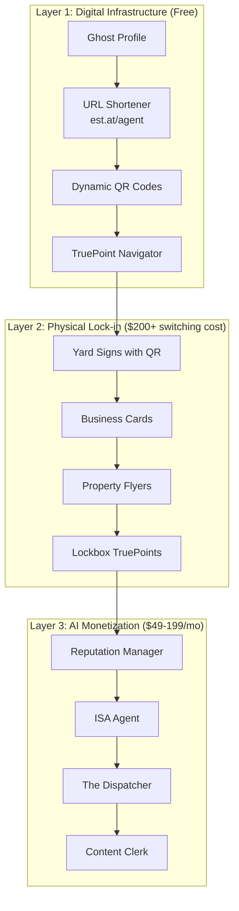

# EstateFlow + TruePoint Complete Ecosystem Architecture

## The Three-Layer Lock-in Strategy



## The Complete Product Stack

### Foundation Layer: PinExacto (Broad Acquisition)
- **Purpose**: Fix general location problems
- **Target**: All homeowners and businesses
- **Lock-in**: Convenience and viral sharing
- **Revenue**: Lead generation for upsell

### Professional Layer: EstateFlow (Agent Focus)
- **Purpose**: Real estate agent ecosystem
- **Target**: 10,000 agents in Puerto Rico
- **Lock-in**: QR codes on physical signs
- **Revenue**: $49-199/mo subscriptions

### Precision Layer: TruePoint (Last-Mile Solution)
- **Purpose**: Exact entrance/service location
- **Target**: Service professionals and agents
- **Lock-in**: Proprietary micro-location data
- **Revenue**: Dispatcher AI + analytics

## Data Flow Architecture

```typescript
interface CompleteEcosystem {
  // User Journey
  acquisition: {
    entry: 'ghost_profile' | 'pin_share' | 'qr_scan' | 'truepoint_receive';
    conversion: 'claim_profile' | 'create_pin' | 'add_truepoint';
    activation: 'first_qr_print' | 'first_share' | 'first_ai_subscription';
  };

  // Data Collection Points
  dataPoints: {
    profiles: GhostProfile[];      // Pre-generated listings
    pins: PinExacto[];             // General locations
    truepoints: TruePoint[];       // Exact entrances
    shortlinks: ShortLink[];       // URL tracking
    qrScans: QRAnalytics[];        // Physical interaction
  };

  // Lock-in Mechanisms
  lockIn: {
    digital: {
      seoRankings: true;          // #1 for agent name
      reviewHistory: true;         // Can't transfer
      leadDatabase: true;          // Historical CRM
    };
    physical: {
      yardSigns: true;             // $200 reprint cost
      businessCards: true;         // In circulation
      propertyFlyers: true;        // Distributed
    };
    network: {
      clientRelationships: true;   // Clients know the link
      vendorNetwork: true;         // Preferred partners
      mlsIntegration: true;        // Listed everywhere
    };
  };

  // Revenue Streams
  revenue: {
    subscriptions: {
      basic: 0;                    // Free tier
      professional: 49;            // Core features
      dispatcher: 49;              // TruePoint AI
      isa: 149;                    // Lead response
      bundle: 199;                 // Everything
    };
    usage: {
      additionalPins: 0.50;        // Per pin over 100
      bulkQR: 20;                  // 100+ QR codes
      analytics: 19;               // Advanced metrics
    };
  };
}
```

## The Viral Cascade Effect

### Level 1: Agent Creates Profile
```
Agent (Jane) → Creates Profile → Gets QR tools → Prints on sign
```

### Level 2: Client Interaction
```
Home Seller → Sees sign → Scans QR → Creates own pin → Shares with services
```

### Level 3: Service Provider Acquisition
```
Plumber → Receives TruePoint → Arrives easily → Sees "Create Your Own" → Signs up
```

### Level 4: Network Amplification
```
Plumber → Shares with other contractors → They sign up → Network grows
```

## Technical Integration Map

```yaml
# Cloudflare Infrastructure
Workers:
  - shortener.est.at       # URL shortening service
  - qr.estateflow.com      # QR code generator
  - pin.enlacepr.com       # PinExacto service
  - true.estateflow.com    # TruePoint navigator

KV Namespaces:
  - shortlinks             # URL mappings
  - qr_destinations        # Dynamic QR routing
  - pin_cache              # Pin data cache
  - analytics_buffer       # Click tracking

D1 Databases:
  - agents                 # User profiles
  - properties             # Listings
  - pins                   # All location types
  - interactions           # Analytics

R2 Buckets:
  - profile-photos         # Agent headshots
  - property-images        # Listing photos
  - truepoint-photos      # Entrance images
  - qr-codes              # Generated QRs

AI Services:
  - text-generation        # Content creation
  - image-recognition      # Photo analysis
  - embeddings            # Semantic search
```

## Monetization Waterfall

### Free User Journey (100%)
```
Discovers ghost profile → Claims it → Adds TruePoints → Generates QR
```

### Conversion Points
```
1. Sees "7 leads waiting" → 30% upgrade to Professional ($49)
2. Misses showing coordination → 20% add Dispatcher ($49)
3. Slow lead response → 10% add ISA ($149)
4. Wants automation → 5% get Bundle ($199)
```

### Revenue Per 100 Users
```
Free:          70 users × $0     = $0
Professional:  15 users × $49    = $735
Pro + Dispatch: 10 users × $98   = $980
Pro + ISA:      3 users × $198   = $594
Bundle:         2 users × $199   = $398
                                   -------
Total MRR from 100 users:         $2,707
Average Revenue Per User:         $27.07
```

## Competitive Moat Analysis

### What We Own vs Competitors

| Asset | Google | Zillow | Wix | EstateFlow |
|-------|--------|--------|-----|------------|
| Map data | ✅ Best | ✅ Good | ❌ None | ✅ Via API |
| Property center | ✅ Yes | ✅ Yes | ❌ No | ✅ Yes |
| Exact entrances | ❌ No | ❌ No | ❌ No | ✅ TruePoint |
| Gate codes | ❌ No | ❌ No | ❌ No | ✅ Encrypted |
| Lockbox locations | ❌ No | ❌ No | ❌ No | ✅ Precise |
| Dynamic QR | ❌ No | ❌ No | ❌ Static | ✅ Dynamic |
| URL shortener | ❌ No | ❌ No | ❌ No | ✅ Branded |
| AI agents | ❌ Limited | ❌ Basic | ❌ No | ✅ Advanced |
| Physical lock-in | ❌ No | ❌ No | ❌ No | ✅ Signs |
| Local edge | ❌ No | ❌ No | ❌ No | ✅ SJU |

### The Unbreakable Moat

```
Physical (QR on signs) +
Digital (SEO rankings) +
Network (viral sharing) +
Data (micro-locations) +
Geographic (SJU edge) =
UNBREAKABLE COMPETITIVE ADVANTAGE
```

## Implementation Priority Matrix

### Must Have (Week 1)
- Ghost profiles
- URL shortener
- Basic QR generator
- Simple TruePoint

### Should Have (Week 2-3)
- The Dispatcher AI
- Photo uploads
- Gate code management
- Analytics dashboard

### Nice to Have (Month 2)
- Vision AI analysis
- Route optimization
- Bulk management
- API access

### Future (Quarter 2)
- Autonomous dispatch
- Predictive routing
- ML-based pricing
- White label

## Success Metrics Framework

### Acquisition Metrics
```typescript
interface AcquisitionMetrics {
  ghostProfilesCreated: number;      // Target: 10,000/mo
  profilesClaimed: number;           // Target: 1,000/mo (10%)
  pinsCreated: number;              // Target: 5,000/mo
  truepointsAdded: number;          // Target: 2,000/mo
}
```

### Activation Metrics
```typescript
interface ActivationMetrics {
  qrCodesGenerated: number;         // Target: 500/mo
  qrCodesPrinted: number;           // Target: 200/mo (40%)
  shortlinksCreated: number;        // Target: 2,000/mo
  firstAISubscription: number;      // Target: 100/mo
}
```

### Revenue Metrics
```typescript
interface RevenueMetrics {
  mrr: number;                      // Target: $50,000 by Month 6
  arpu: number;                     // Target: $27
  ltv: number;                      // Target: $2,376
  cac: number;                      // Target: <$10
  ltvCacRatio: number;             // Target: >200x
}
```

### Viral Metrics
```typescript
interface ViralMetrics {
  sharesPerUser: number;            // Target: 8
  clicksPerShare: number;           // Target: 0.4
  conversionPerClick: number;       // Target: 0.05
  kFactor: number;                  // Target: >0.6
  viralCycleTime: number;          // Target: <7 days
}
```

## Risk Mitigation Strategies

### Technical Risks
- **Cloudflare outage**: Multi-region failover
- **D1 limits**: Implement caching layer
- **R2 costs**: Optimize image sizes
- **AI quality**: Human review queue

### Business Risks
- **Low QR adoption**: Partner with print shops
- **Agent churn**: Increase switching costs
- **Competition copying**: Patent TruePoint method
- **Market saturation**: Expand to US mainland

### Regulatory Risks
- **Data privacy**: Implement GDPR compliance
- **Real estate laws**: Partner with local MLS
- **Payment regulations**: Multiple processors
- **AI transparency**: Clear AI disclosures

## Conclusion

The EstateFlow + TruePoint ecosystem creates multiple interlocking moats:

1. **Data Moat**: Own micro-location data Google lacks
2. **Physical Moat**: QR codes on expensive signs
3. **Network Moat**: Viral B2B2C mechanics
4. **Geographic Moat**: San Juan edge location
5. **Relationship Moat**: Direct client connections

Each layer reinforces the others, creating a platform that becomes more valuable and harder to leave over time.

**The Formula**:
```
Free Tools (acquisition) ×
Physical Lock-in (retention) ×
AI Agents (monetization) ×
Network Effects (growth) =
UNSTOPPABLE PLATFORM
```

**The Mission**: Stop selling websites. Start owning infrastructure. 🚀