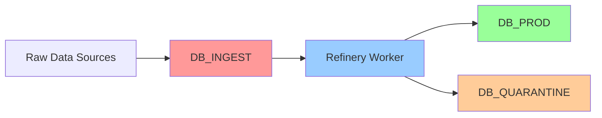

# SiteForge/EnlacePR Platform Architecture

## Executive Summary

The SiteForge/EnlacePR platform is a multi-tenant, Cloudflare-native ecosystem designed to solve hyper-local logistics challenges while providing automated website and marketing services for small-to-medium businesses (SMBs). The platform serves multiple regional brands from a single codebase, each tailored to specific market needs.

## Core Platform Brands

### 1. SiteForge (Global)
- **Market**: Trade industries worldwide
- **Focus**: Automated website generation
- **Key Features**: AI content, lead capture, SMS automation

### 2. EnlacePR (Puerto Rico)
- **Market**: Puerto Rico businesses
- **Focus**: Solving "Urbanization/Km" addressing chaos
- **Key Features**: Gate Photos, ATH Móvil integration, Spanish-first
- **Domain**: enlacepr.com

### 3. TownLink (United States)
- **Market**: US small businesses
- **Focus**: Professional web presence and local services
- **Key Features**: Stripe payments, English interface
- **Domain**: townlink.us

## Architecture Pillars

### 1. Multi-Tenant Foundation

#### Tenant Resolution Mechanism
```typescript
// _middleware.ts
export async function onRequest(context: Context) {
  const url = new URL(context.request.url);
  const brand = resolveBrand(url.hostname);

  context.env.BRAND = brand;
  return context.next();
}

function resolveBrand(hostname: string): BrandContext {
  if (hostname.includes('enlacepr')) return 'PR';
  if (hostname.includes('townlink')) return 'US';
  return 'GLOBAL'; // SiteForge default
}
```

#### Brand Configuration Matrix
| Brand | Locale | Payment | Font | Primary Color | Icon Style |
|-------|---------|---------|------|---------------|------------|
| EnlacePR | es-PR | ATH Móvil | Rubik | Orange-500 | Solid/Rounded |
| TownLink | en-US | Stripe | Inter | Emerald-600 | Outline/Sharp |
| SiteForge | Multi | Various | Inter | Blue-600 | Solid/Modern |

### 2. Cloudflare-Native Infrastructure

#### The "Local Edge" Advantage
- **San Juan (SJU) Data Center**: <10ms latency for Caribbean users
- **Hurricane Resilience**: Continues functioning if undersea cables are cut
- **Data Residency**: Compliance for government/healthcare sectors

#### Technology Stack
```yaml
Application Layer:
  - Compute: Remix on Cloudflare Workers
  - Domains: Cloudflare for SaaS
  - Runtime: Edge-first execution

Data Layer:
  - Primary DB: Cloudflare D1 (SQLite)
  - Object Storage: R2 (logos, Gate Photos)
  - Edge Cache: Workers KV (QR/short links)

Intelligence Layer:
  - AI: Workers AI (Llama-3, Gemini)
  - Security: Turnstile (CAPTCHA replacement)
  - Tunnels: Cloudflared (Secure Box)
```

### 3. Data Pipeline Architecture

#### Double D1 Pipeline


#### Refinery Process (Hourly Cron)
1. **Read**: Fetch unprocessed rows from DB_INGEST
2. **Clean**: AI-powered text normalization
3. **Enrich**: Add ICP tags (is_mobile, needs_mapping, etc.)
4. **Validate**: Strict Zod schema enforcement
5. **Deduplicate**: Check against existing records
6. **Promote**: Move to DB_PROD as 'ghost' listing

#### ICP Campaign Examples
```javascript
const campaigns = [
  {
    name: "Unmappable",
    filter: "address LIKE '%Int%' OR address LIKE '%Km%'",
    tags: ["needs_gate_photo", "addressing_chaos"]
  },
  {
    name: "Digital Ghosts",
    filter: "website IS NULL OR website LIKE '%facebook.com%'",
    tags: ["needs_website", "high_conversion"]
  }
];
```

### 4. AI Agentic Workforce

#### Tenant Operations Agents
- **Content Generator**: Llama-3 powered onboarding
- **On-Site Agent**: Browser-based chat support
- **WhatsApp Bot**: Dual-role concierge/business bot

#### Growth Engine Agents
- **Reputation Manager**: Automated review requests
- **Sales Nurturer**: 24/7 lead engagement
- **Booking Concierge**: Appointment scheduling

#### Platform DevOps Agents
- **Gemini Reviewer**: PR security/quality checks
- **Changelog Bot**: Automated documentation updates

## Puerto Rico-Specific Solutions

### The "Urbanization/Km" Problem
Puerto Rico's addressing system creates unique challenges:
- Urbanizations with internal numbering systems
- Kilometer markers on rural routes
- Multiple entrances to business complexes
- Navigation apps frequently fail

### Gate Photo System
```typescript
interface GatePhoto {
  id: string;
  tenant_id: number;
  photo_url: string; // R2 storage
  coordinates: {
    lat: number;
    lng: number;
  };
  instructions: string; // "Enter through blue gate"
  verification_count: number;
}
```

### ATH Móvil Integration
```typescript
// Payment processor selection by region
const paymentProcessor = {
  'PR': {
    primary: 'ath_movil',
    fallback: 'stripe',
    currency: 'USD',
    businessLogic: 'immediate_transfer'
  },
  'US': {
    primary: 'stripe',
    fallback: 'paypal',
    currency: 'USD',
    businessLogic: 'standard_ach'
  }
};
```

## Database Schema Extensions

### Core Tables (Updated)
```sql
-- Multi-brand tenant support
ALTER TABLE tenants ADD COLUMN brand TEXT DEFAULT 'GLOBAL';
ALTER TABLE tenants ADD COLUMN locale TEXT DEFAULT 'en-US';
ALTER TABLE tenants ADD COLUMN payment_processor TEXT DEFAULT 'stripe';
ALTER TABLE tenants ADD COLUMN urbanization TEXT; -- PR-specific
ALTER TABLE tenants ADD COLUMN gate_instructions TEXT;

-- Gate Photos for delivery verification
CREATE TABLE gate_photos (
    id INTEGER PRIMARY KEY AUTOINCREMENT,
    tenant_id INTEGER NOT NULL,
    photo_url TEXT NOT NULL,
    latitude DECIMAL(10, 8),
    longitude DECIMAL(11, 8),
    instructions TEXT,
    verification_count INTEGER DEFAULT 0,
    created_at TIMESTAMP DEFAULT CURRENT_TIMESTAMP,
    FOREIGN KEY (tenant_id) REFERENCES tenants(id)
);

-- WhatsApp conversations
CREATE TABLE whatsapp_conversations (
    id INTEGER PRIMARY KEY AUTOINCREMENT,
    tenant_id INTEGER,
    phone_number TEXT NOT NULL,
    thread_id TEXT UNIQUE,
    last_message_at TIMESTAMP,
    context TEXT, -- JSON conversation history
    status TEXT DEFAULT 'active',
    created_at TIMESTAMP DEFAULT CURRENT_TIMESTAMP
);

-- Regional compliance
CREATE TABLE data_residency (
    id INTEGER PRIMARY KEY AUTOINCREMENT,
    tenant_id INTEGER NOT NULL,
    jurisdiction TEXT NOT NULL, -- 'PR', 'US', 'EU'
    compliance_level TEXT, -- 'standard', 'healthcare', 'government'
    data_location TEXT, -- Edge location constraint
    audit_log TEXT, -- JSON audit trail
    FOREIGN KEY (tenant_id) REFERENCES tenants(id)
);
```

### Pipeline Tables
```sql
-- Raw data ingestion
CREATE TABLE db_ingest.raw_businesses (
    id INTEGER PRIMARY KEY AUTOINCREMENT,
    source TEXT, -- 'google_maps', 'yellow_pages', 'facebook'
    raw_data TEXT, -- JSON blob
    campaign TEXT, -- 'unmappable', 'digital_ghosts'
    status TEXT DEFAULT 'unprocessed',
    created_at TIMESTAMP DEFAULT CURRENT_TIMESTAMP
);

-- Quarantined data for review
CREATE TABLE db_quarantine.failed_businesses (
    id INTEGER PRIMARY KEY AUTOINCREMENT,
    raw_data TEXT,
    validation_errors TEXT,
    attempted_at TIMESTAMP,
    reviewed BOOLEAN DEFAULT FALSE
);
```

## Implementation Roadmap

### Phase 1: Foundation (Current)
- [x] Multi-tenant architecture
- [x] Brand theming system
- [x] Basic tenant websites
- [ ] D1 database pipeline

### Phase 2: Regional Launch (Q1 2025)
- [ ] EnlacePR brand launch
- [ ] ATH Móvil integration
- [ ] Gate Photo system
- [ ] Spanish localization

### Phase 3: AI Agents (Q2 2025)
- [ ] WhatsApp bot deployment
- [ ] Sales Nurturer agent
- [ ] Reputation Manager
- [ ] Gemini DevOps agents

### Phase 4: Scale & Compliance (Q3 2025)
- [ ] PR-IX peering
- [ ] Data residency suite
- [ ] Government contracts
- [ ] Healthcare compliance

## Competitive Advantages

### 1. The Context Moat
While competitors have maps, we own the ground truth:
- **Gate Photos**: Visual verification
- **Technician Photos**: Trust building
- **Local Payment**: ATH Móvil native integration
- **Cultural Fit**: Tú vs. You, community-focused

### 2. Edge Performance
- **<10ms latency**: San Juan edge location
- **Hurricane resilient**: Local caching
- **Data sovereignty**: Jurisdiction compliance

### 3. Automated Acquisition
- **Ghost profiles**: Pre-populated directory
- **Lead traps**: Automated sales triggers
- **ICP targeting**: Campaign-based scraping

## Security & Compliance

### Data Protection
- **Encryption**: At rest (D1) and in transit (TLS)
- **Access Control**: Row-level security in Workers
- **Audit Trails**: Comprehensive logging

### Regional Compliance
- **GDPR**: EU data subjects
- **HIPAA**: Healthcare clients
- **PRIPA**: Puerto Rico privacy act

### Infrastructure Security
- **DDoS Protection**: Cloudflare shield
- **Bot Management**: Turnstile integration
- **Secure Tunnels**: Cloudflared boxes

## Monitoring & Analytics

### Key Metrics
```typescript
const kpis = {
  technical: {
    latency_p95: '<50ms',
    uptime: '99.99%',
    error_rate: '<0.1%'
  },
  business: {
    ghost_to_claimed: '20%',
    lead_to_customer: '15%',
    mrr_per_tenant: '$89'
  },
  regional: {
    pr_market_share: '30%',
    gate_photo_coverage: '80%',
    ath_movil_adoption: '60%'
  }
};
```

### Observability Stack
- **Cloudflare Analytics**: Traffic and performance
- **Workers Metrics**: Custom KPIs
- **Sentry**: Error tracking
- **Custom Dashboard**: D1 aggregations

## Future Vision

### Network Independence
- **PR-IX Peering**: Direct Caribbean connectivity
- **Satellite Backup**: Starlink integration
- **Mesh Network**: Community resilience

### AI Evolution
- **Voice Agents**: Phone call handling
- **Video Verification**: Gate photo AI validation
- **Predictive Routing**: ML-optimized deliveries

### Market Expansion
- **USVI**: Virgin Islands expansion
- **Dominican Republic**: Spanish Caribbean
- **Miami**: Caribbean diaspora

---

**Our moat is not the map, but the context.** We own the last-mile truth that makes local commerce possible in challenging environments.