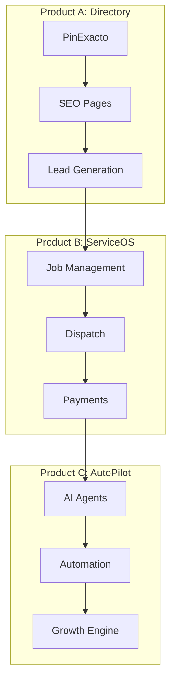
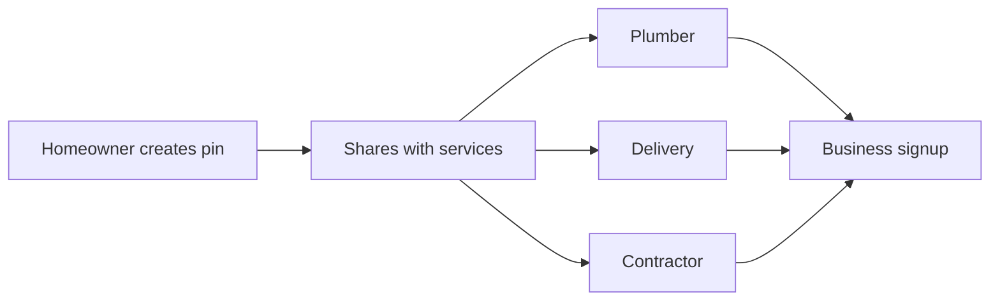
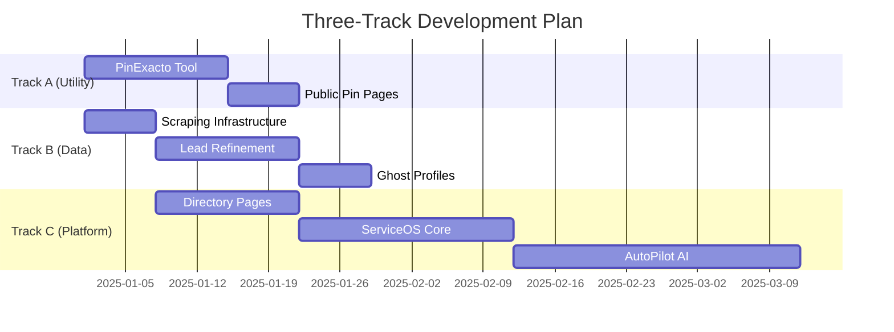

# Product Strategy: EnlacePR / TownLink

## Executive Summary

EnlacePR (Puerto Rico) and TownLink (United States) represent a unified platform strategy to solve the "last mile" chaos in local service logistics. Our approach uses a free location-fixing utility (PinExacto/ExactPin) as the wedge to acquire users, then expands into a comprehensive service operating system with AI-driven automation.

## 1. The Strategic Opportunity

### The Core Problem
Standard mapping solutions fail dramatically in markets with unstructured addressing:
- **The "Back Alley Problem"**: Navigation apps route to the wrong entrance
- **High Cognitive Load**: Business owners become manual dispatchers
- **Ephemeral Communication**: Location sharing gets lost in chat history

### Our Solution: The PinExacto Wedge

```typescript
interface PinExacto {
  core: "Owner-verified high-precision location";
  format: "Universal link that opens in any map app";
  cost: "Free forever";
  purpose: "Strategic user acquisition wedge";
}
```

**Key Insight**: Fixing the pin is not the endgame; it's the anchor point for a comprehensive service logistics platform.

## 2. The Three-Layer Product Stack

### Product Architecture



### Product A: Directory (Traffic Engine)
**Purpose**: Lead generation through SEO-optimized discovery
**Features**:
- Verified business profiles
- City/category landing pages
- Ghost profiles for unclaimed businesses
**Monetization**: Free (lead magnet)

### Product B: ServiceOS (Logistics Engine)
**Purpose**: Operating system for service businesses
**Features**:
- Job Links for service coordination
- Gate Photos for visual verification
- Payment collection (ATH Móvil/Stripe)
- Team dispatch
**Monetization**: $29-39/month

### Product C: AutoPilot (Automation Engine)
**Purpose**: AI-driven business growth
**Features**:
- Automated review requests
- Missed call text-back
- AI chat responses
- Lead nurturing
**Monetization**: $89-129/month

## 3. Ideal Customer Profiles (ICPs)

### Automated Acquisition Strategy

```typescript
interface ICP {
  profile: string;
  pain: string;
  digitalSignal: string[];
  engagement: string;
}

const targetProfiles: ICP[] = [
  {
    profile: "🛠 Unmappable Service",
    pain: "Complex addressing (Urbanizations, Km markers)",
    digitalSignal: ["address contains 'Int'", "address contains 'Km'", "reviews mention 'hard to find'"],
    engagement: "Detectamos que tu negocio aparece en el lugar incorrecto en el mapa."
  },
  {
    profile: "🚛 Mobile Mover",
    pain: "No fixed address, suspended listings",
    digitalSignal: ["category = 'Food Truck'", "category contains 'Mobile'", "address = residential"],
    engagement: "Tu negocio móvil necesita una ubicación verificada permanente."
  },
  {
    profile: "👻 Digital Ghost",
    pain: "No website, only social media",
    digitalSignal: ["website IS NULL", "website contains 'facebook.com'"],
    engagement: "Crea tu sitio web profesional gratis en 60 segundos."
  }
];
```

### The Homeowner Funnel (B2B2C)



**Strategy**: Target rural homeowners and gated communities. Each creates a free pin and shares with dozens of service providers, creating organic B2B acquisition.

## 4. Competitive Differentiation

### Competitive Landscape

| Competitor Type | Examples | Our Counter |
|-----------------|----------|-------------|
| **Pin Utilities** | What3Words, Plus Codes | "Don't make customers learn 3 words. Just send a link." |
| **Good Enough** | WhatsApp Location | "A permanent link that never gets lost in chat." |
| **Enterprise** | Onfleet, Tookan | "The CRM for the guy with one van." |

### Our Strategic Moat

```typescript
const strategicMoat = {
  hyperLocalFit: {
    description: "Purpose-built for PR/Caribbean addressing chaos",
    features: ["Urbanization logic", "Gate Photos", "Spanish-first"]
  },

  dataMoat: {
    description: "We own the context, not just coordinates",
    data: ["Gate photos", "Entrance instructions", "Technician faces", "Job status"]
  },

  paymentMoat: {
    description: "Native regional payment integration",
    integrations: ["ATH Móvil (PR)", "Stripe (US)", "Local methods"]
  },

  workflowIntegration: {
    description: "Pin is the hook, platform is the moat",
    ecosystem: ["Logistics", "Payments", "Marketing", "AI automation"]
  }
};
```

## 5. Phased Implementation Roadmap

### Development Tracks (Parallel Execution)



### Phase 1: Pin Utility (Weeks 1-2)
**Objective**: Launch free utility, start data capture

```typescript
const phase1 = {
  deliverables: [
    "Pin Fixer Tool",
    "Public shareable pin pages",
    "Scraping infrastructure",
    "Lead enrichment pipeline"
  ],
  metrics: {
    pins_created: 1000,
    businesses_scraped: 5000,
    ghost_profiles: 500
  }
};
```

### Phase 2: Ghost Directory (Weeks 3-4)
**Objective**: Activate acquisition engine

```typescript
const phase2 = {
  deliverables: [
    "City/category SEO pages",
    "Ghost profile pages",
    "Lead trap notifications",
    "Automated engagement triggers"
  ],
  metrics: {
    organic_traffic: 10000,
    lead_captures: 500,
    ghost_claims: 100
  }
};
```

### Phase 3: Business Engine (Month 2)
**Objective**: Turn on monetization

```typescript
const phase3 = {
  deliverables: [
    "Pro website builder",
    "Job Link generator",
    "Payment integration",
    "Team dispatch features"
  ],
  metrics: {
    paid_subscribers: 50,
    jobs_created: 500,
    payments_processed: "$10,000"
  }
};
```

## 6. Monetization Strategy

### Value-Based Pricing Tiers

```typescript
interface PricingTier {
  name: string;
  pricePR: number;
  priceUS: number;
  targetAudience: string;
  conversionTrigger: string;
}

const pricingTiers: PricingTier[] = [
  {
    name: "Starter",
    pricePR: 0,
    priceUS: 0,
    targetAudience: "New/Solo businesses",
    conversionTrigger: "Leads visible but locked"
  },
  {
    name: "Professional",
    pricePR: 29,
    priceUS: 39,
    targetAudience: "Active contractors",
    conversionTrigger: "Need to unlock leads and process payments"
  },
  {
    name: "Growth (AI)",
    pricePR: 89,
    priceUS: 129,
    targetAudience: "Established teams",
    conversionTrigger: "Want automation and growth"
  }
];
```

### Revenue Expansion Loops

```typescript
const revenueStreams = {
  core: {
    subscriptions: "$29-129/mo",
    annualizedValue: "$348-1,548/year"
  },

  expansion: {
    transactionFees: "1% of payments processed",
    teamSeats: "$15/seat/month",
    spotlightAds: "$5/day for geo-boost",
    conciergeSetup: "$199 one-time"
  },

  future: {
    secureBox: "$99/mo hardware rental",
    apiAccess: "$299/mo enterprise",
    whitelabel: "$999/mo agency"
  }
};
```

### Key Feature Matrix

| Feature | Starter (Free) | Professional ($29/39) | Growth ($89/129) |
|---------|---------------|----------------------|------------------|
| **Directory Listing** | ✅ | ✅ | ✅ |
| **PinExacto Tool** | ✅ | ✅ | ✅ |
| **Basic QR Code** | ✅ | ✅ | ✅ |
| **Lead Alerts** | ⚠️ Locked | ✅ Unlocked | ✅ Unlocked |
| **Custom Domain** | ❌ | ✅ | ✅ |
| **Job Links** | ❌ | ✅ | ✅ |
| **Gate Photos** | ❌ | ✅ | ✅ |
| **Payment Processing** | ❌ | ✅ ATH/Stripe | ✅ ATH/Stripe |
| **AI Review Requests** | ❌ | ❌ | ✅ |
| **Missed Call Text** | ❌ | ❌ | ✅ |
| **AI Chatbot** | ❌ | ❌ | ✅ |
| **Team Dispatch** | ❌ | 1 user | 5 users |

## 7. The Long-Term Vision: Caribbean Edge Infrastructure

### Phase 1: Solution Provider (Year 1)
```typescript
const phase1Goals = {
  certification: "Cloudflare Partner",
  marketing: "SJU Guarantee (<10ms latency)",
  differentiation: "Hurricane-resilient hosting"
};
```

### Phase 2: Hardware Play (Year 2)
```typescript
const enlaceSecureBox = {
  product: "Pre-configured Cloudflare Tunnel device",
  target: "Law firms, clinics, professional services",
  pricing: "$99/month rental + $299 setup",
  value: "Secure remote access without VPN complexity"
};
```

### Phase 3: Network Interconnect (Year 3)
```typescript
const networkStrategy = {
  peering: ["Liberty PR", "Claro", "PR-IX"],
  guarantee: "100% uptime during cable cuts",
  value: "Critical infrastructure for PR digital economy"
};
```

## 8. Success Metrics & KPIs

### Phase 1 Metrics (Months 1-3)
```typescript
const phase1KPIs = {
  acquisition: {
    pins_created: 5000,
    ghost_profiles: 10000,
    directory_listings: 15000
  },
  engagement: {
    weekly_active_users: 1000,
    lead_capture_rate: "5%",
    ghost_claim_rate: "10%"
  }
};
```

### Phase 2 Metrics (Months 4-6)
```typescript
const phase2KPIs = {
  revenue: {
    mrr: 10000,
    paying_customers: 300,
    average_revenue_per_user: 35
  },
  product: {
    jobs_created: 5000,
    payments_processed: 100000,
    gate_photos_uploaded: 1000
  }
};
```

### Phase 3 Metrics (Year 1)
```typescript
const phase3KPIs = {
  scale: {
    total_businesses: 50000,
    paying_customers: 1500,
    annual_revenue_run_rate: 750000
  },
  moat: {
    market_share_pr: "30%",
    gate_photo_network: 10000,
    exclusive_partnerships: 5
  }
};
```

## 9. Risk Mitigation

### Technical Risks
| Risk | Mitigation |
|------|------------|
| **Scraping blocks** | Multiple data sources, manual submission |
| **Map API limits** | Cache aggressively, use multiple providers |
| **Payment failures** | Multiple processors, manual backup |

### Market Risks
| Risk | Mitigation |
|------|------------|
| **Slow adoption** | Free tier, ghost profiles, lead magnets |
| **Competition** | Deep local features, payment moat |
| **Economic downturn** | Focus on cost-saving automation |

### Operational Risks
| Risk | Mitigation |
|------|------------|
| **Support burden** | AI chatbots, community support |
| **Churn** | Annual discounts, feature locks |
| **Scaling costs** | Edge caching, efficient queries |

## 10. Implementation Priorities

### Week 1-2: Core Utility
1. [ ] Launch PinExacto tool
2. [ ] Deploy scraping infrastructure
3. [ ] Create public pin pages
4. [ ] Start data enrichment pipeline

### Week 3-4: Directory Activation
1. [ ] Generate ghost profiles
2. [ ] Create SEO landing pages
3. [ ] Implement lead traps
4. [ ] Launch engagement triggers

### Month 2: Monetization
1. [ ] Enable payment processing
2. [ ] Launch job management
3. [ ] Activate pro features
4. [ ] Start paid marketing

### Month 3: Automation
1. [ ] Deploy AI agents
2. [ ] Implement review system
3. [ ] Launch team features
4. [ ] Scale acquisition

## Conclusion

EnlacePR/TownLink solves a fundamental problem with a simple wedge (PinExacto) that expands into a comprehensive platform. By focusing on specific ICPs with acute pain points, automating acquisition, and building deep local moats, we're positioned to dominate the Caribbean SMB logistics market while building critical regional infrastructure.

**The Strategy**: Fix the pin. Own the context. Power the economy.