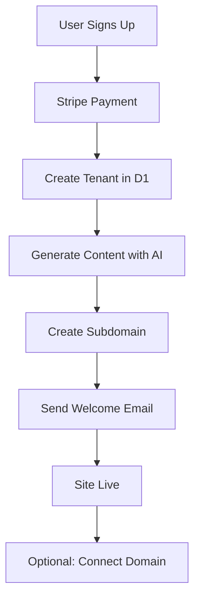

# SiteForge Platform Documentation

## Overview
SiteForge is an automated Website-as-a-Service (WaaS) platform that instantly generates industry-specific websites for small businesses, particularly focusing on trade industries (plumbers, HVAC, landscapers, electricians).

## Architecture

### Technology Stack
- **Framework**: Remix (React SSR)
- **Runtime**: Cloudflare Workers
- **Database**: Cloudflare D1 (SQLite)
- **Storage**: Cloudflare R2
- **AI**: Workers AI (Llama 3)
- **Domains**: Cloudflare for SaaS
- **Payments**: Stripe
- **SMS**: Twilio

### Multi-Tenant Architecture
Single codebase serving thousands of clients through hostname detection:
```
joesplumbing.com → Tenant ID 101 → Plumber Theme
coolcomfort.com → Tenant ID 102 → HVAC Theme
```

## Features

### Core Features (MVP)
1. **Instant Site Generation** - AI-powered content creation
2. **Zero-Touch Onboarding** - Automated setup process
3. **Custom Domains** - Automatic SSL provisioning
4. **Lead Capture** - Contact forms with email notifications
5. **Mobile Responsive** - Works on all devices
6. **SEO Optimized** - Server-side rendering

### Premium Features
1. **AI Lead Response** - Auto SMS responses to inquiries
2. **Missed Call Text Back** - Never miss a lead
3. **Review Management** - Automated review requests
4. **Analytics Dashboard** - Track performance
5. **Custom Branding** - Logo, colors, fonts

## Database Schema

### Key Tables
- `tenants` - Business accounts
- `site_content` - AI-generated and edited content
- `leads` - Customer inquiries
- `services` - Business services offered
- `analytics` - Event tracking

See `/shared/schemas/database.sql` for complete schema.

## Development Guide

### Local Setup
```bash
# Navigate to SiteForge
cd worktrees/siteforge

# Install dependencies
npm install

# Create D1 database locally
wrangler d1 create siteforge-db --local

# Apply schema
wrangler d1 execute siteforge-db --local --file=../../shared/schemas/database.sql

# Start development server
npm run dev
```

### Environment Variables
```env
# .env.local
STRIPE_SECRET_KEY=sk_test_...
STRIPE_WEBHOOK_SECRET=whsec_...
TWILIO_ACCOUNT_SID=AC...
TWILIO_AUTH_TOKEN=...
TWILIO_PHONE_NUMBER=+1...
OPENAI_API_KEY=sk-... # Optional for enhanced AI
```

### Deployment
```bash
# Build application
npm run build

# Deploy to Cloudflare
npm run deploy
```

## Onboarding Workflow

### User Journey
1. **Sign Up** - Enter business details
2. **AI Generation** - Content created automatically
3. **Preview** - Instant site preview
4. **Payment** - Choose subscription tier
5. **Domain** - Connect custom domain (optional)
6. **Live** - Site goes live immediately

### Automation Flow


## Content Generation

### AI Prompts
Content is generated using Workers AI with industry-specific prompts:

```javascript
const prompt = `Write a hero section for a ${industry} business in ${city}.
Focus on trust, reliability, and quick response. Maximum 2 sentences.`;
```

### Content Sections
- **Hero** - Main headline and call-to-action
- **Services** - List of offered services
- **About** - Business description
- **Contact** - Contact form and information
- **Testimonials** - Customer reviews
- **Footer** - Legal and contact info

## Multi-Tenant Routing

### Hostname Detection
```typescript
// app/lib/tenant.server.ts
export async function getTenantByHostname(hostname: string) {
  // Check custom domains
  const customDomain = await db.query(
    'SELECT * FROM tenants WHERE custom_domain = ?',
    [hostname]
  );

  // Check subdomains
  if (hostname.endsWith('.siteforge.com')) {
    const subdomain = hostname.split('.')[0];
    return await db.query(
      'SELECT * FROM tenants WHERE subdomain = ?',
      [subdomain]
    );
  }
}
```

### Theme Application
Themes are applied via CSS variables based on industry:
```css
[data-industry="plumber"] {
  --color-primary: #0ea5e9;
  --color-secondary: #f59e0b;
}
```

## Lead Management

### Lead Capture Flow
1. Visitor fills out contact form
2. Lead saved to D1 database
3. Email sent to business owner
4. (Premium) SMS auto-response sent
5. Lead appears in dashboard

### AI Auto-Response
```javascript
// Premium feature
async function sendAutoResponse(lead) {
  const message = `Hi ${lead.name}, thanks for contacting ${business.name}.
    I saw your request about ${lead.service}.
    When would be a good time to discuss? I have openings at 2pm and 4pm today.`;

  await twilio.messages.create({
    to: lead.phone,
    from: business.twilioNumber,
    body: message
  });
}
```

## Pricing & Subscriptions

### Tiers
1. **Free ($0-9/mo)**
   - Subdomain only
   - Basic features
   - SiteForge branding

2. **Professional ($49/mo)**
   - Custom domain
   - No branding
   - Email support

3. **AI Admin ($99-199/mo)**
   - AI lead response
   - Analytics
   - Priority support

### Stripe Integration
```javascript
// Webhook handler
async function handleStripeWebhook(event) {
  switch(event.type) {
    case 'checkout.session.completed':
      await activateTenant(event.data.metadata.tenantId);
      break;
    case 'customer.subscription.deleted':
      await deactivateTenant(event.data.metadata.tenantId);
      break;
  }
}
```

## Performance Optimization

### Caching Strategy
- Static assets cached in Cloudflare CDN
- Database queries cached in Workers KV
- AI-generated content cached for 24 hours

### SEO Optimization
- Server-side rendering for all pages
- Structured data (JSON-LD) for local businesses
- Sitemap generation
- Meta tags optimization

## Monitoring & Analytics

### Key Metrics
- Page views per tenant
- Lead conversion rate
- Average response time
- Subscription churn rate
- AI generation success rate

### Error Tracking
- Sentry integration for error monitoring
- Custom error boundaries in React
- Cloudflare Analytics for performance

## Security

### Best Practices
- SQL injection prevention via prepared statements
- XSS protection with React's built-in escaping
- CSRF tokens for forms
- Rate limiting on API endpoints
- Secure webhook validation

### Data Privacy
- GDPR compliance features
- Data export functionality
- Secure data deletion
- Cookie consent management

## Future Enhancements

### Planned Features
1. **Appointment Booking** - Integrated calendar
2. **Live Chat** - Real-time customer support
3. **Email Marketing** - Automated campaigns
4. **Google My Business** - Integration
5. **Social Media** - Auto-posting
6. **Multi-language** - Support for Spanish, etc.

### Scaling Considerations
- Database sharding by tenant ID
- Regional edge deployments
- Background job processing with Queues
- Real-time features with Durable Objects

## Support & Documentation

### Resources
- API Documentation: `/docs/API.md`
- Component Library: `/app/components/`
- Database Schema: `/shared/schemas/database.sql`
- Deployment Guide: `/docs/DEPLOYMENT.md`

### Getting Help
1. Check documentation
2. Review error logs in Cloudflare dashboard
3. Contact support team
4. Community Discord (planned)