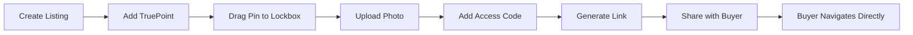
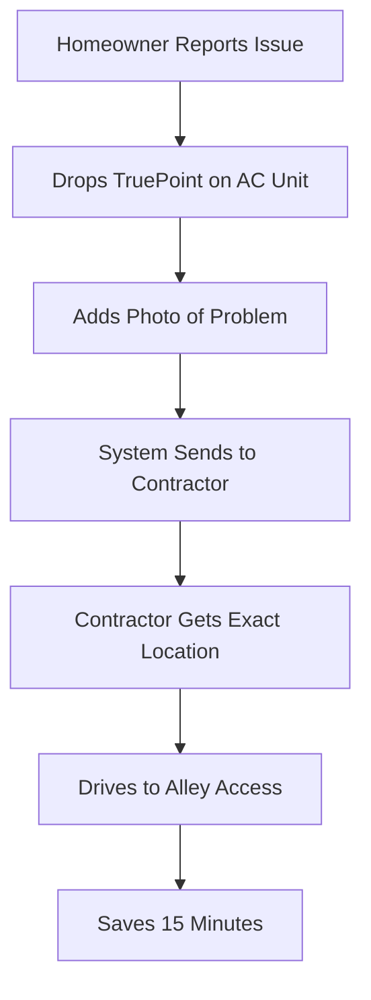

# TruePoint Implementation Guide

## The "Last-Mile" Navigator for EstateFlow

### Executive Summary

TruePoint evolves our pin concept from "find the property" to "find the exact entrance/lockbox/service panel." This creates an even stronger moat by owning the micro-location data that Google Maps lacks.

## Core Concept

### The Problem Hierarchy
```
Level 1: Can't find the address → Solved by PinExacto
Level 2: Can't find the right entrance → Solved by TruePoint
Level 3: Don't know the access code → Solved by TruePoint Context
```

### The Solution Stack
- **1-meter precision** pin placement on satellite view
- **Visual context** with photos of exact locations
- **Access instructions** (gate codes, parking spots, lockbox locations)
- **Native maps integration** via smart redirects
- **Time-bound access** for temporary pins

## Integration Architecture

### 1. For Real Estate Agents - "The Showing Assistant"

```typescript
interface ShowingPin {
  id: string;
  listingId: string;
  agentId: string;

  // Precise locations
  locations: {
    lockbox: TruePoint;
    parking: TruePoint;
    mainEntrance: TruePoint;
    serviceEntrance?: TruePoint;
  };

  // Access management
  access: {
    gateCode?: string;
    lockboxCode?: string;
    parkingSpot?: string;
    specialInstructions?: string;
  };

  // Temporal control
  validity: {
    startTime?: Date;
    endTime?: Date;
    oneTimeUse?: boolean;
  };

  // Analytics
  usage: {
    views: number;
    navigations: number;
    uniqueVisitors: string[];
  };
}
```

#### Agent Workflow


### 2. For Service Workers - "The Trade Route"

```typescript
interface ServicePin {
  id: string;
  customerId: string;
  jobId: string;

  // Problem locations
  problemLocation: TruePoint; // "AC unit in backyard"
  parkingLocation: TruePoint; // "Park in alley"
  toolDropLocation?: TruePoint; // "Leave tools by side gate"

  // Service context
  context: {
    problemPhoto: string;
    accessPath: string; // "Through side gate, not front"
    hazards?: string; // "Dog in yard"
    utilityShutoffs?: TruePoint[]; // Water, gas, electrical
  };

  // Contractor sharing
  sharedWith: {
    contractorId: string;
    sharedAt: Date;
    accessed: boolean;
  }[];
}
```

#### Service Workflow


## Technical Implementation

### TruePoint Data Model

```typescript
interface TruePoint {
  id: string;
  ownerId: string;

  // Precision location
  coordinates: {
    latitude: number;  // 6 decimal places minimum
    longitude: number; // 6 decimal places minimum
    altitude?: number; // For multi-story buildings
  };

  // Visual context
  media: {
    photo?: string;      // R2 storage URL
    video?: string;      // For complex access
    thumbnail?: string;  // Quick preview
  };

  // Semantic labeling
  label: string; // "Service Entrance", "Lockbox", "AC Unit"
  category: 'entrance' | 'parking' | 'equipment' | 'utility' | 'hazard';

  // Access information
  access: {
    instructions?: string;
    code?: string; // Encrypted
    schedule?: string; // "Mon-Fri 9-5"
    restrictions?: string; // "No trucks over 10ft"
  };

  // Temporal control
  temporal: {
    validFrom?: Date;
    validUntil?: Date;
    oneTimeToken?: string;
    maxUses?: number;
    currentUses: number;
  };

  // Analytics
  analytics: {
    created: Date;
    lastAccessed?: Date;
    totalAccesses: number;
    uniqueUsers: Set<string>;
    conversionRate?: number; // Views to navigation
  };
}
```

### The Smart Redirector Worker

```typescript
// workers/truepoint/src/index.ts
export default {
  async fetch(request: Request, env: Env): Promise<Response> {
    const url = new URL(request.url);
    const pinId = url.pathname.split('/').pop();

    // Get pin data
    const pin = await env.PINS.get(pinId);
    if (!pin) {
      return Response.redirect('https://estateflow.com/pin-not-found', 302);
    }

    const pinData: TruePoint = JSON.parse(pin);

    // Check temporal validity
    if (pinData.temporal.validUntil && new Date() > pinData.temporal.validUntil) {
      return Response.redirect('https://estateflow.com/pin-expired', 302);
    }

    // Track access
    await trackAccess(env, pinId, request);

    // Detect device and redirect
    const userAgent = request.headers.get('User-Agent') || '';
    const isIOS = /iPhone|iPad|iPod/i.test(userAgent);
    const isAndroid = /Android/i.test(userAgent);

    // Build redirect URL
    let redirectUrl: string;
    if (isIOS) {
      // Apple Maps URL scheme
      redirectUrl = `maps://maps.apple.com/?ll=${pinData.coordinates.latitude},${pinData.coordinates.longitude}&q=${encodeURIComponent(pinData.label)}&z=19`;
    } else if (isAndroid) {
      // Google Maps URL
      redirectUrl = `https://www.google.com/maps/search/?api=1&query=${pinData.coordinates.latitude},${pinData.coordinates.longitude}&query_place_id=${encodeURIComponent(pinData.label)}`;
    } else {
      // Desktop - show landing page
      return showLandingPage(pinData, env);
    }

    return Response.redirect(redirectUrl, 302);
  }
};

// Show rich landing page for desktop
function showLandingPage(pin: TruePoint, env: Env): Response {
  const html = `
    <!DOCTYPE html>
    <html>
    <head>
      <title>${pin.label} - TruePoint Navigator</title>
      <meta name="viewport" content="width=device-width, initial-scale=1">
      <style>
        body { font-family: system-ui; margin: 0; background: #f5f5f5; }
        .container { max-width: 600px; margin: 0 auto; background: white; }
        .header { background: linear-gradient(135deg, #667eea 0%, #764ba2 100%); color: white; padding: 2rem; }
        .photo { width: 100%; height: 300px; object-fit: cover; }
        .content { padding: 2rem; }
        .coordinates { font-family: monospace; background: #f0f0f0; padding: 1rem; border-radius: 8px; }
        .instructions { background: #fff3cd; border: 1px solid #ffc107; padding: 1rem; border-radius: 8px; margin: 1rem 0; }
        .button { display: inline-block; background: #667eea; color: white; padding: 1rem 2rem; text-decoration: none; border-radius: 8px; font-weight: bold; }
        .cta-banner { background: #e3f2fd; padding: 1rem; margin-top: 2rem; border-radius: 8px; }
      </style>
    </head>
    <body>
      <div class="container">
        <div class="header">
          <h1>${pin.label}</h1>
          <p>Precise navigation to exact location</p>
        </div>

        ${pin.media.photo ? `` : ''}

        <div class="content">
          <div class="coordinates">
            📍 ${pin.coordinates.latitude.toFixed(6)}, ${pin.coordinates.longitude.toFixed(6)}
          </div>

          ${pin.access.instructions ? `
            <div class="instructions">
              <strong>Access Instructions:</strong><br>
              ${pin.access.instructions}
              ${pin.access.code ? `<br><br><strong>Code:</strong> ${pin.access.code}` : ''}
            </div>
          ` : ''}

          <div style="margin: 2rem 0;">
            <a href="https://www.google.com/maps/search/?api=1&query=${pin.coordinates.latitude},${pin.coordinates.longitude}" class="button">
              Open in Google Maps
            </a>
            <a href="maps://maps.apple.com/?ll=${pin.coordinates.latitude},${pin.coordinates.longitude}&q=${encodeURIComponent(pin.label)}" class="button" style="margin-left: 1rem;">
              Open in Apple Maps
            </a>
          </div>

          <div class="cta-banner">
            <strong>Service Professional?</strong><br>
            Stop getting lost. Create your own TruePoints for free.<br>
            <a href="https://estateflow.com/signup?source=truepoint">Claim Your Profile →</a>
          </div>
        </div>
      </div>
    </body>
    </html>
  `;

  return new Response(html, {
    headers: { 'Content-Type': 'text/html' }
  });
}
```

## The AI Dispatcher Agent

### New Premium Agent: "The Dispatcher" ($49/mo addon or included in Pro)

```typescript
class DispatcherAgent {
  name = 'The Dispatcher';
  triggers = ['showing_scheduled', 'service_booked', 'delivery_arranged'];

  async onShowingScheduled(showing: Showing) {
    const pins = await this.getShowingPins(showing.listingId);

    // Send to buyer agent 1 hour before
    await this.scheduleMessage({
      to: showing.buyerAgent.phone,
      sendAt: showing.time - 60 * 60 * 1000, // 1 hour before
      message: `
        Hi! Your showing at ${showing.address} is in 1 hour.

        📍 Lockbox location: ${pins.lockbox.url}
        🚗 Parking: ${pins.parking.url}
        🔐 Gate code: ${pins.access.gateCode}
        📝 Note: ${pins.access.instructions}

        - ${showing.listingAgent.name}
      `
    });
  }

  async analyzeAccessPhoto(photo: Buffer): Promise<AccessAnalysis> {
    // Use Cloudflare Workers AI for vision analysis
    const analysis = await env.AI.run('@cf/microsoft/resnet-50', {
      image: photo
    });

    // Detect keypad, lockbox, gate, etc.
    const features = this.detectAccessFeatures(analysis);

    return {
      hasKeypad: features.keypad,
      hasLockbox: features.lockbox,
      hasGate: features.gate,
      suggestedLabel: this.generateLabel(features),
      suggestedCategory: this.categorizeLocation(features)
    };
  }

  async coordinateMultiStop(stops: ServicePin[]): Promise<Route> {
    // Optimize route for multiple service calls
    const optimized = this.optimizeRoute(stops);

    // Generate sequential TruePoints
    return {
      stops: optimized,
      estimatedTime: this.calculateTotalTime(optimized),
      instructions: this.generateRouteInstructions(optimized)
    };
  }
}
```

## The Viral Loop Mechanics

### Scenario: Non-Platform User Receives TruePoint

```mermaid
graph TD
    A[Plumber asks for address] --> B[Homeowner sends TruePoint]
    B --> C[Plumber clicks link]
    C --> D[Sees exact location + photo]
    D --> E[Sees "Create Your Own" banner]
    E --> F[Claims free profile]
    F --> G[Creates own TruePoints]
    G --> H[Shares with customers]
    H --> I[Viral loop continues]
```

### Conversion Funnel

```typescript
interface TruePointViralMetrics {
  // Exposure
  totalShares: number;
  uniqueRecipients: number;

  // Engagement
  linkClicks: number;
  navigationStarts: number;

  // Conversion
  bannerViews: number;
  signupClicks: number;
  profilesCreated: number;

  // Viral coefficient
  k_factor: number; // New users from each share
  cycle_time: number; // Days to complete viral loop
}
```

## Mapbox Integration

### Satellite Pin Dropper Component

```typescript
// app/components/TruePointCreator.tsx
import mapboxgl from 'mapbox-gl';

export function TruePointCreator({ onPinCreate }) {
  const mapRef = useRef<mapboxgl.Map>();
  const markerRef = useRef<mapboxgl.Marker>();

  useEffect(() => {
    mapRef.current = new mapboxgl.Map({
      container: 'map',
      style: 'mapbox://styles/mapbox/satellite-v9',
      center: [-66.1057, 18.4655], // Puerto Rico
      zoom: 18, // Maximum zoom for detail
    });

    // Enable drag-to-place
    mapRef.current.on('click', (e) => {
      const { lng, lat } = e.lngLat;

      // Update or create marker
      if (markerRef.current) {
        markerRef.current.setLngLat([lng, lat]);
      } else {
        markerRef.current = new mapboxgl.Marker({ draggable: true })
          .setLngLat([lng, lat])
          .addTo(mapRef.current);
      }

      // Update coordinates
      onPinCreate({ latitude: lat, longitude: lng });
    });
  }, []);

  return (
    <div className="relative">
      <div id="map" className="w-full h-96 rounded-lg" />

      <div className="absolute top-4 right-4 bg-white rounded-lg p-4 shadow-lg">
        <h3 className="font-semibold mb-2">Drop Your Pin</h3>
        <ol className="text-sm text-gray-600">
          <li>1. Zoom to your location</li>
          <li>2. Click exact spot</li>
          <li>3. Drag to adjust</li>
        </ol>
      </div>

      <button
        onClick={captureScreenshot}
        className="absolute bottom-4 right-4 bg-blue-600 text-white px-4 py-2 rounded-lg shadow-lg"
      >
        <Camera className="w-5 h-5 inline mr-2" />
        Capture Location
      </button>
    </div>
  );
}
```

## Implementation Phases

### Phase 1: Core TruePoint (Week 1)
- [ ] Mapbox integration with satellite view
- [ ] Drag-to-pin functionality
- [ ] Basic redirect worker
- [ ] Pin data model in D1

### Phase 2: Visual Context (Week 2)
- [ ] Photo upload to R2
- [ ] Access instructions fields
- [ ] Gate code encryption
- [ ] Landing page for desktop

### Phase 3: The Dispatcher (Week 3)
- [ ] AI agent for automated coordination
- [ ] SMS scheduling system
- [ ] Vision AI for photo analysis
- [ ] Multi-stop optimization

### Phase 4: Viral Mechanics (Week 4)
- [ ] Conversion tracking
- [ ] A/B test banner messaging
- [ ] Referral attribution
- [ ] Growth metrics dashboard

## Revenue Impact

### New Revenue Streams

1. **The Dispatcher Agent**: $49/mo addon
   - 30% of Pro users upgrade = 150 users
   - Additional revenue: $7,350/mo

2. **TruePoint Analytics**: $19/mo
   - See who's accessing your pins
   - Heat map of popular locations
   - Conversion tracking

3. **Bulk Pin Management**: $99/mo
   - For property managers
   - Manage 100+ properties
   - Bulk import/export

### Increased Conversion

- **Before TruePoint**: 10% claim rate on ghost profiles
- **After TruePoint**: 25% claim rate (useful tool drives action)
- **Revenue Impact**: 2.5x conversion = 2.5x revenue

## Competitive Moat Enhancement

### What We Own That Google Doesn't

| Data Type | Google Maps | TruePoint |
|-----------|------------|-----------|
| Property center | ✅ Yes | ✅ Yes |
| Service entrance | ❌ No | ✅ Yes |
| Lockbox location | ❌ No | ✅ Yes |
| Gate codes | ❌ No | ✅ Yes |
| Parking instructions | ❌ Limited | ✅ Detailed |
| Access photos | ❌ No | ✅ Yes |
| Temporal access | ❌ No | ✅ Yes |
| Service-specific | ❌ No | ✅ Yes |

### The Data Moat

```
Every TruePoint created = Proprietary location data
Every share = Viral exposure
Every navigation = Usage validation
Every conversion = Network growth
```

## Success Metrics

### Week 1 Targets
- [ ] 100 TruePoints created
- [ ] 500 navigations started
- [ ] 50 photos uploaded
- [ ] 10 viral conversions

### Month 1 Targets
- [ ] 5,000 TruePoints created
- [ ] 20,000 navigations
- [ ] 2,000 pins with photos
- [ ] 500 new users from viral

### Success Indicators
- **Navigation Success Rate**: >95% arrive at correct location
- **Time Saved**: Average 12 minutes per service call
- **Viral K-Factor**: >0.5 (each user brings 0.5 new users)
- **Pin Reuse**: Average pin shared 8+ times

## Conclusion

TruePoint transforms EstateFlow from a directory into a **logistics intelligence platform**. By owning the "last mile" navigation data that even Google lacks, we create:

1. **Immediate Value**: Solve real navigation problems
2. **Viral Growth**: Every share exposes non-users
3. **Data Moat**: Proprietary micro-location dataset
4. **Revenue Expansion**: New AI agent to monetize

The genius: **We're not competing with Google Maps. We're completing it.**

Every lockbox location, every service entrance, every gate code becomes our proprietary data. This data becomes invaluable for logistics companies, delivery services, and eventually autonomous vehicles.

**Stop sending addresses. Send exact doorsteps.** 🎯